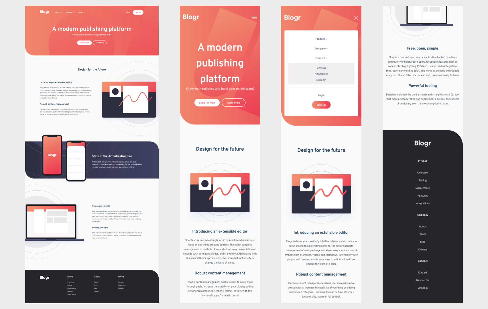

## Table of contents

- [Overview](#overview)
  - [The challenge](#the-challenge)
  - [Screenshot](#screenshot)
  - [Links](#links)
- [My process](#my-process)

  - [Built with](#built-with)
  - [What I learned](#what-i-learned)

- [Author](#author)

## Overview

In this challenge I learn how to build responsive website with the given design.

### The challenge

- View the optimal layout for the site depending on their device's screen size
- See hover states for all interactive elements on the page

### Screenshot

### Links

- Live Site URL: [Blogr](https://ddd-blogr.netlify.app)

## My process

### Built with

- Semantic HTML5 markup
- CSS custom properties
- Flexbox
- CSS Grid
- Sass
- Vanilla JS

### What I learned

In this project I learn how to write css using Sass. I also learn how to create dropdown menu using CSS and a little bit of Javascript.

## Author

- Twitter - [@lycopene_dev](https://www.twitter.com/lycopene_dev)
